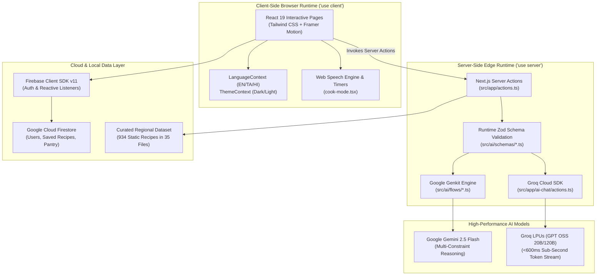

# CookMitra AI — Comprehensive Technical Dossier & Project Explanation (v3.0)

[](https://nextjs.org)
[](https://react.dev)
[](https://www.typescriptlang.org)
[](https://tailwindcss.com)
[](https://firebase.google.com)
[](https://firebase.google.com/docs/genkit)
[](https://deepmind.google/technologies/gemini/)
[](https://groq.com)
[](https://www.framer.com/motion/)
[](LICENSE)

> **CookMitra AI (v3.0)**: An intelligent culinary companion and smart kitchen ecosystem that transforms household ingredients into authentic regional Indian recipes, personalized 7-day nutritional meal plans, and real-time interactive chef guidance in seconds.

---

## Table of Contents
1. [Project Vision & Problem Statement](#1-project-vision--problem-statement)
2. [End-to-End System Architecture](#2-end-to-end-system-architecture)
3. [Deep-Dive Feature Breakdown & Code Architecture](#3-deep-dive-feature-breakdown--code-architecture)
   - 3.1 [934+ Curated Regional Recipe Explorer](#31-934-curated-regional-recipe-explorer)
   - 3.2 [Dual-Engine AI Intelligence (Genkit + Groq LPU)](#32-dual-engine-ai-intelligence-genkit--groq-lpu)
   - 3.3 [Zero-Waste Smart Pantry & Instant Commerce](#33-zero-waste-smart-pantry--instant-commerce)
   - 3.4 [7-Day Precision Meal Planner & PDF Exporter](#34-7-day-precision-meal-planner--pdf-exporter)
   - 3.5 [Ayurvedic Healing Foods & Health Matrices](#35-ayurvedic-healing-foods--health-matrices)
   - 3.6 [Hands-Free Interactive Voice Cook Mode](#36-hands-free-interactive-voice-cook-mode)
   - 3.7 [Native Indic Multilingual Architecture (EN · TA · HI)](#37-native-indic-multilingual-architecture-en--ta--hi)
4. [Backend Architecture: Why Full-Stack Next.js 15?](#4-backend-architecture-why-full-stack-nextjs-15)
5. [Database & Security Engineering (Firebase Firestore)](#5-database--security-engineering-firebase-firestore)
6. [Codebase Directory Map & Key Files](#6-codebase-directory-map--key-files)
7. [Step-by-Step Live Presentation Guide for Evaluators](#7-step-by-step-live-presentation-guide-for-evaluators)
8. [Frequently Asked Questions by Judges & Evaluators](#8-frequently-asked-questions-by-judges--evaluators)

---

## 1. Project Vision & Problem Statement

### The Everyday Kitchen Paradox
In millions of households across India, three primary problems recur every single day:
1. **Decision Fatigue**: An estimated 30 to 45 minutes are lost daily deliberating *"What should we cook today?"* while balancing conflicting preferences across family members.
2. **Food & Economic Waste**: Over 20–30% of fresh vegetables, dairy, and herbs spoil inside refrigerators because individuals forget what is already available or do not know what recipe accommodates remaining odds and ends.
3. **Cultural Incompatibility of Existing Apps**: Western recipe platforms cannot interpret Indian cooking techniques (e.g. *tadka*, *dum*, *bhunao*) or regional spice combinations. Furthermore, they require exotic, expensive ingredients that are unavailable in local *sabzi mandis*.

### The CookMitra AI Solution
CookMitra AI bridges traditional Indian culinary wisdom with cutting-edge Generative AI. It allows users to input whatever ingredients they currently possess and instantly outputs culturally authentic, step-by-step Indian recipes tailored to their budget, regional taste, and health objectives.

---

## 2. End-to-End System Architecture

CookMitra AI uses a **Unified Serverless Architecture** on Next.js 15 App Router that cleanly separates Client Reactivity from Server-Side AI Execution:



---

## 3. Deep-Dive Feature Breakdown & Code Architecture

### 3.1 934+ Curated Regional Recipe Explorer
- **Location**: [`src/app/recipes/page.tsx`](file:///c:/Users/24ad105.RITDC/Desktop/project/src/app/recipes/page.tsx) and [`src/lib/recipes/`](file:///c:/Users/24ad105.RITDC/Desktop/project/src/lib/recipes/)
- **Technical Operation**:
  - The catalog encompasses **934 curated, authentic recipes** distributed across 35 regional files covering all **28 States and major Union Territories** of India.
  - Interactive SVG map ([`src/components/recipes/india-region-map.tsx`](file:///c:/Users/24ad105.RITDC/Desktop/project/src/components/recipes/india-region-map.tsx)) allows users to click on any region or state and instantly filter traditional dishes native to that geography.
  - Substring search queries dish names, ingredients, descriptions, and regional tags with zero server roundtrips for maximum responsiveness.
  - 13 distinct course categories: *Curries & Gravies*, *Snacks & Street Food*, *Desserts*, *Rice & Biryanis*, *Protein Specialties*, *Breakfast & Tiffin*, etc.

### 3.2 Dual-Engine AI Intelligence (Genkit + Groq LPU)
- **Location**: [`src/ai/`](file:///c:/Users/24ad105.RITDC/Desktop/project/src/ai/) and [`src/app/ai-chat/actions.ts`](file:///c:/Users/24ad105.RITDC/Desktop/project/src/app/ai-chat/actions.ts)
- **Technical Operation**:
  - **Conversational Assistant ("Chef Momo")**: Powered by Groq's Language Processing Units (LPU) running `openai/gpt-oss-20b`. First-token latency is under **600ms**, delivering near-instant streaming responses for cooking advice, emergency rescue tips (e.g. *too salty, too spicy*), and ingredient substitutions.
  - **Structured Recipe Generator**: Powered by Google Genkit utilizing `gemini-2.5-flash`. Form submissions validate available ingredients, maximum preparation time, budget cap, and dietary constraints against strict Zod schemas ([`src/ai/schemas/recipe-schemas.ts`](file:///c:/Users/24ad105.RITDC/Desktop/project/src/ai/schemas/recipe-schemas.ts)).
  - **Zero-Hallucination Fallback**: If Gemini faces API rate limits or latency thresholds, Groq Cloud acts as an automatic fallback with JSON mode enforcement.

### 3.3 Zero-Waste Smart Pantry & Instant Commerce
- **Location**: [`src/app/pantry/page.tsx`](file:///c:/Users/24ad105.RITDC/Desktop/project/src/app/pantry/page.tsx) and [`src/lib/ingredients-catalog.ts`](file:///c:/Users/24ad105.RITDC/Desktop/project/src/lib/ingredients-catalog.ts)
- **Technical Operation**:
  - Users maintain their current household inventory in Firestore under `users/{uid}/pantry`.
  - The app compares pantry contents against recipe ingredient manifests, marking recipes as:
    - 🟢 **100% Cookable Now** (No grocery run required).
    - 🟡 **Missing 1–2 Ingredients** (Highlights exact missing items and displays estimated cost in ₹).
  - Missing ingredients include direct deep links to quick-commerce apps (**Zepto**, **Blinkit**, **Swiggy Instamart**) to order exact missing items with a single tap.

### 3.4 7-Day Precision Meal Planner & PDF Exporter
- **Location**: [`src/app/healthy-meal-planner/page.tsx`](file:///c:/Users/24ad105.RITDC/Desktop/project/src/app/healthy-meal-planner/page.tsx) and [`src/lib/pdf-export.ts`](file:///c:/Users/24ad105.RITDC/Desktop/project/src/lib/pdf-export.ts)
- **Technical Operation**:
  - The Genkit flow (`generate-healthy-meal-plan.ts`) processes user metrics (Age, Activity Level, Diet Type, Cuisine Style, Household Size, Weekly Budget in ₹) to generate a complete 28-meal schedule (Breakfast, Lunch, Snack, Dinner across 7 days).
  - Calculates average daily calories, protein intake, and total estimated grocery cost.
  - Features **1-Click Meal Swapping**: If a user dislikes a specific meal, a lightweight Groq action replaces only that specific slot without regenerating the remaining 27 meals.
  - Client-side PDF generation using `jspdf` and `jspdf-autotable` produces a printer-friendly weekly chart and grocery shopping list.

### 3.5 Ayurvedic Healing Foods & Health Matrices
- **Location**: [`src/app/healing-foods/page.tsx`](file:///c:/Users/24ad105.RITDC/Desktop/project/src/app/healing-foods/page.tsx) and [`src/lib/healing-foods/`](file:///c:/Users/24ad105.RITDC/Desktop/project/src/lib/healing-foods/)
- **Technical Operation**:
  - Synthesizes classical Ayurvedic nutritional principles (*Tridosha balance*, *Agni*, cooling vs. warming foods) with modern clinical nutrition.
  - Provides dedicated matrices for conditions such as:
    - **Diabetes & Insulin Sensitivity** (low glycemic index, fenugreek, bitter gourd).
    - **Thyroid Health & Metabolism** (selenium, iodine, brassica moderation).
    - **Hypertension & Heart Health** (potassium-rich, low sodium, garlic, flaxseed).
    - **PCOS / Hormonal Balance** and **Gut Health / Digestion**.

### 3.6 Hands-Free Interactive Voice Cook Mode
- **Location**: [`src/components/recipe/cook-mode.tsx`](file:///c:/Users/24ad105.RITDC/Desktop/project/src/components/recipe/cook-mode.tsx)
- **Technical Operation**:
  - Built specifically for cooking scenarios where hands are covered in flour, oil, or spices.
  - **Speech Synthesis**: Uses the native browser `window.speechSynthesis` API to vocalize instructions for each step.
  - **Dynamic Time Extraction**: Employs regular expressions (`/(\d+)\s*(?:minutes?|mins?|seconds?|secs?)/i`) to detect cooking durations in instructions and creates an instant countdown timer with audio alerts.
  - **Zero-Touch Key Controls**: Spacebar advances to the next step, Left Arrow moves back, `T` toggles the timer, and `Esc` exits.

### 3.7 Native Indic Multilingual Architecture (EN · TA · HI)
- **Location**: [`src/context/language-context.tsx`](file:///c:/Users/24ad105.RITDC/Desktop/project/src/context/language-context.tsx) and [`src/lib/translations.ts`](file:///c:/Users/24ad105.RITDC/Desktop/project/src/lib/translations.ts)
- **Technical Operation**:
  - Provides 100% full-site localization across **English**, **தமிழ் (Tamil)**, and **हिन्दी (Hindi)**.
  - Strict TypeScript type safety: `TranslationKey = keyof typeof translations.en` ensures that adding a key to English enforces identical keys in Tamil and Hindi, preventing runtime missing key bugs.
  - Server actions automatically inspect the active client language and inject instructions into AI prompts to deliver generated recipe titles, descriptions, and steps directly in native Tamil or Hindi script while preserving recognized culinary dish names.

---

## 4. Backend Architecture: Why Full-Stack Next.js 15?

In technical evaluations, judges frequently ask: *"Why is there no separate Express/FastAPI folder?"*

### The Modern Architectural Answer
In 2026, modern enterprise software has moved beyond the overhead of maintaining decoupled Express servers for web applications. Next.js 15 provides a **Full-Stack Serverless Architecture** that offers distinct advantages:

1. **Zero Network Hop Latency**: Server Actions run in the same cloud environment as page rendering, eliminating inter-service HTTP roundtrips.
2. **Complete Secret Isolation**: Backend files (`src/app/actions.ts`, `src/ai/*`) use `'use server'` directives. They are compiled into isolated Node.js/Edge endpoints and are never bundled into the client browser JavaScript.
3. **End-to-End Type Safety**: Changes to database models or Zod schemas immediately trigger TypeScript compiler errors across both client and server code, preventing API drift.
4. **Single-Pane Deployment**: 1-click CI/CD on Vercel Edge networks without managing separate server ports, Docker containers, or CORS configuration.

---

## 5. Database & Security Engineering (Firebase Firestore)

### Security Model (`firestore.rules`)
Firestore enforces user-scoped isolation through declarative security rules:

```javascript
rules_version = '2';
service cloud.firestore {
  match /databases/{database}/documents {
    // User profile and private subcollections
    match /users/{userId} {
      allow read, write: if request.auth != null && request.auth.uid == userId;
      
      match /pantry/{item} {
        allow read, write: if request.auth != null && request.auth.uid == userId;
      }
      match /savedRecipes/{recipeId} {
        allow read, write: if request.auth != null && request.auth.uid == userId;
      }
      match /mealPlans/{planId} {
        allow read, write: if request.auth != null && request.auth.uid == userId;
      }
    }

    // Public community recipe reviews
    match /recipes/{recipeId}/notes/{noteId} {
      allow read: if true;
      allow create: if request.auth != null;
      allow update, delete: if request.auth != null && request.auth.uid == resource.data.userId;
    }
  }
}
```

---

## 6. Codebase Directory Map & Key Files

```
c:\Users\24ad105.RITDC\Desktop\project/
├── src/
│   ├── ai/                        # Backend AI Engine
│   │   ├── flows/                 # Genkit flow orchestrators (Gemini 2.5 Flash)
│   │   ├── schemas/               # Zod validation schemas for AI I/O
│   │   └── genkit.ts              # Google Genkit client configuration
│   ├── app/                       # 14 Cleaned Production Routes (App Router)
│   │   ├── actions.ts             # Primary Backend Server Actions ('use server')
│   │   ├── page.tsx               # Main Landing Page with 3D animation showcases
│   │   ├── home/                  # Authenticated user dashboard & typewriter search
│   │   ├── recipes/               # 934-recipe explorer & India region map
│   │   ├── ai-recipes/            # Custom recipe generation portal
│   │   ├── ai-chat/               # Chef Momo interactive chat interface
│   │   ├── healthy-meal-planner/  # 7-day meal planner & PDF generator
│   │   ├── healing-foods/         # Ayurvedic culinary medicine matrix
│   │   ├── encyclopedia/          # Indian spices & ingredients encyclopedia
│   │   ├── pantry/                # Smart household pantry tracker
│   │   ├── my-recipes/            # User saved recipe collection
│   │   ├── ingredients/           # Ingredient price & category catalog
│   │   ├── pricing/               # Platform plans & student tier info
│   │   ├── faq/                   # Platform FAQs & help center
│   │   └── settings/              # Account preferences & theme management
│   ├── components/                # Modular UI Components
│   │   ├── ai-chat/               # Chat bubbles, streaming typing indicators
│   │   ├── layout/                # Global Header, Icon Sidebar, Footer, Language Toggle
│   │   ├── recipe/                # 3D Flip Card, Cook Mode, Missing Ingredients modal
│   │   └── ui/                    # Design system (buttons, dialogs, sliders, tabs)
│   ├── context/                   # LanguageContext (EN/TA/HI) & ThemeContext
│   └── lib/                       # Business Logic & Datasets
│       ├── recipes/               # 35 Curated Regional Recipe Files (934 authentic dishes)
│       ├── healing-foods/         # Condition guides & Ayurvedic nutritional mappings
│       ├── firebase/              # Firebase v11 client SDK & reactive hooks
│       └── translations.ts        # Comprehensive 3-language dictionary
├── PROJECT_ABSTRACT.md            # Academic & expo presentation abstract
├── PROJECT_OVERVIEW.md            # Full architecture & framework specification
├── README.md                      # Primary project presentation README
└── package.json                   # Dependencies & run scripts
```

---

## 7. Step-by-Step Live Presentation Guide for Evaluators

### ⏰ Time Allotment: 3 to 4 Minutes

| Step | Screen / Action | What to Say / Demonstrate |
| :---: | :--- | :--- |
| **0:00 - 0:45** | **Home Landing Page (`/`)** | *"Welcome! We built CookMitra AI to solve daily meal decision fatigue and domestic vegetable waste across Indian households. Notice our design system built with Tailwind CSS and Framer Motion."* **Click the Language Toggle to switch from English to தமிழ் (Tamil) or हिन्दी (Hindi).** Show how all services, comparison rows, and navigation items update instantaneously. |
| **0:45 - 1:30** | **Regional Explorer (`/recipes`)** | *"Unlike Western apps that lump all Indian food together, we have curated 934 recipes across 28 Indian States. Clicking on Kerala or Bengal on this interactive map immediately filters traditional dishes native to that soil."* Show instantaneous search substring matching for *"Biryani"* or *"Dosa"*. |
| **1:30 - 2:15** | **Chef Momo AI Chat (`/ai-chat`)** | *"Here is Chef Momo, our conversational assistant. Powered by Groq's LPU architecture, watch the sub-second response time."* Ask: *"I don't have tamarind for Rasam, what can I use?"* Point out how Chef Momo provides culturally authentic kitchen chemistry substitutions in under 600ms. |
| **2:15 - 3:00** | **Meal Planner (`/healthy-meal-planner`)** | *"Our 7-Day Precision Meal Planner calculates daily calories, protein, and estimated cost in Indian Rupees. If a user dislikes a meal, our 1-click swap replaces only that meal slot. Users can export the complete plan to Google Calendar or download a formatted PDF grocery checklist."* |
| **3:00 - 3:30** | **Hands-Free Cook Mode** | Open any recipe and launch **Cook Mode**. Show how the Web Speech API reads instructions aloud, and point to the automatic countdown timer extracted from *"simmer for 10 minutes"*. |

---

## 8. Frequently Asked Questions by Judges & Evaluators

### Q1: How do you prevent AI hallucinations in recipes?
> **Answer**: We use a dual strategy: First, we anchor the platform on 934 verified, static regional recipes. Second, for on-the-fly AI generation, we use Google Genkit with strict Zod schemas requiring exact numerical measurements, cooking times, and ingredient arrays. The model is constrained to structured JSON, preventing invented or toxic combinations.

### Q2: What is the benefit of Groq LPU over standard OpenAI APIs?
> **Answer**: Cooking is a real-time activity. Standard cloud APIs often introduce 3 to 6-second latency delays while generating tokens. Groq LPUs run at deterministic speeds, delivering first-token output in under 600ms. This makes Chef Momo feel like an instant, live kitchen companion.

### Q3: How does your app help with zero food waste?
> **Answer**: Most food waste occurs because home cooks don't realize what they can make with ingredients currently in their fridge before they spoil. Our Smart Pantry feature filters recipes against current household stock, highlights recipes that are 100% ready to cook, and quantifies missing ingredients with localized prices so users buy only what they actually need.

### Q4: How is user data protected?
> **Answer**: Authentication is handled by Firebase Auth, supporting both Email/Password and Anonymous trial sessions. Firestore database access is locked down using declarative security rules (`firestore.rules`) where users can only read and write to their own scoped subcollections. API keys are completely protected on the server side via Next.js Server Actions.

---

*CookMitra AI — Engineered with passion for Indian culinary heritage and cutting-edge software engineering.*
